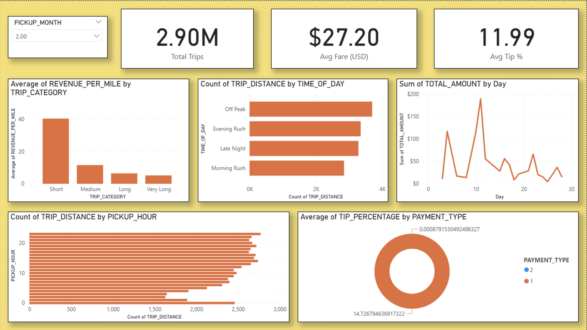
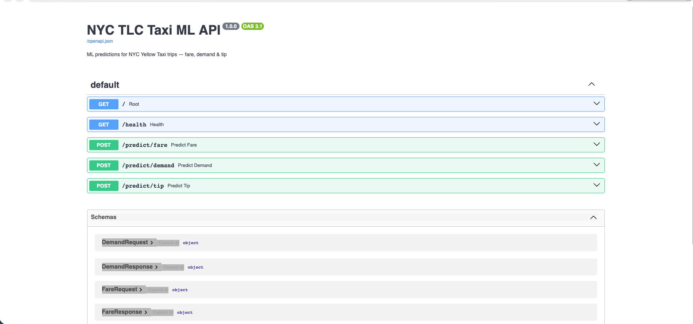

# 🗽 NYC TLC Cloud Data Pipeline


## 🏗️ Architecture


## 📋 Project Overview
End-to-end cloud data pipeline processing **5.7M NYC Yellow Taxi trips**
across a full Bronze → Silver → Gold medallion architecture with ML
predictions served via REST API.

## 🔧 Tech Stack
| Layer | Technology |
|---|---|
| Ingestion | Python, GCS (Bronze layer) |
| Transformation | PySpark 3.5, Docker |
| Warehouse | Snowflake, COPY INTO |
| Modeling | dbt Core, Star Schema |
| ML | XGBoost, Scikit-learn |
| API | FastAPI, Pydantic |
| Dashboard | Power BI |

## 📊 Pipeline Stages

### 1. Data Ingestion (Bronze)
- Downloaded 2 months of NYC TLC Yellow Taxi data (~6M rows)
- Uploaded raw Parquet files to GCS Bronze bucket

### 2. PySpark Transformation (Silver)
- Cleaned and enriched data using PySpark
- Removed outliers, added 6 engineered features
- Wrote partitioned Parquet back to GCS Silver bucket

### 3. Snowflake Load (Gold)
- Loaded 5.7M rows into Snowflake via COPY INTO
- Achieved ~5 min bulk load time

### 4. dbt Modeling
- Built star schema: 1 fact table + 3 dimension tables
- 7 models, 10 data quality tests — all passing
- Incremental loading on FACT_TRIPS

### 5. ML Models
| Model | Algorithm | Score |
|---|---|---|
| Fare Prediction | XGBoost Regressor | RMSE $6.61, R² 0.905 |
| Demand Forecasting | XGBoost Regressor | RMSE 9.22 trips, R² 0.896 |
| Tip Prediction | XGBoost Classifier | Accuracy 90.5% |

### 6. FastAPI
3 REST endpoints serving ML predictions:
- `POST /predict/fare` — predicted fare + confidence range
- `POST /predict/demand` — trip demand level by location/hour
- `POST /predict/tip` — tip prediction + recommended tip amount

### 7. Power BI Dashboard


## 🚀 How to Run

### Prerequisites
- Python 3.11+
- GCP Account
- Snowflake Account
- dbt Core

### API Setup
```bash
git clone https://github.com/yourusername/nyc-tlc-data-pipeline
cd nyc-tlc-data-pipeline/api
pip install -r requirements.txt
python download_models.py
uvicorn main:app --reload --port 8000
```

### API Docs

